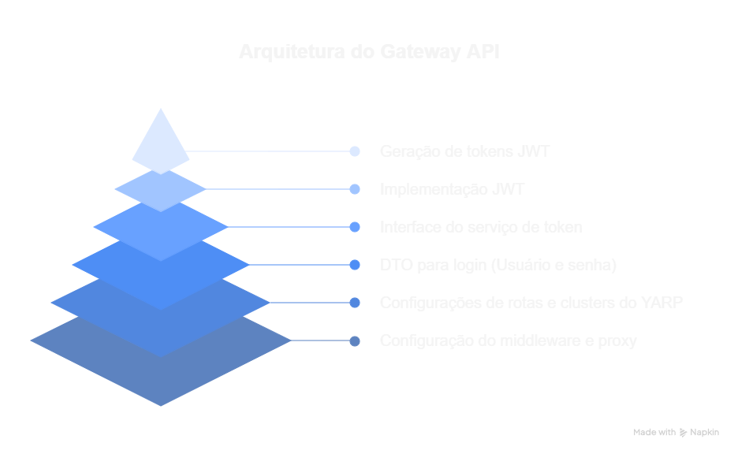

# 🛡️ API Gateway com .NET 8, YARP e JWT

Este projeto é um **API Gateway genérico e reutilizável** desenvolvido em **ASP.NET Core 8** usando a biblioteca **YARP (Yet Another Reverse Proxy)**. Ele permite o roteamento de requisições para múltiplos serviços, com suporte a **HTTPS**, **autenticação JWT** e boas práticas de segurança.

---

## 🚀 Tecnologias Utilizadas

[](https://dotnet.microsoft.com/)
[](https://microsoft.github.io/reverse-proxy/)
[](https://jwt.io/)
[](https://www.docker.com/)
[](https://swagger.io/)

- [.NET 8](https://dotnet.microsoft.com/)
- [YARP (Yet Another Reverse Proxy)](https://microsoft.github.io/reverse-proxy/)
- Autenticação com [JWT (JSON Web Token)](https://jwt.io/)
- [ASP.NET Core Web API](https://learn.microsoft.com/aspnet/core/)
- Configuração via `appsettings.json`

## 📁 Estrutura do Projeto

  

```bash
APIGateway/
│
├── Controllers/
│ └── AuthController.cs # Geração de tokens JWT
│
├── Interfaces/
│ └── ITokenService.cs # Interface do serviço de token
│
├── Services/
│ └── TokenService.cs # Implementação JWT
│
├── DTOs/
│ └── LoginRequestDto.cs # DTO para login(Usuario e senha)
│
├── appsettings.json # Configurações de rotas e clusters do YARP
│
└── Program.cs # Configuração do middleware, autenticação e proxy 
```

## ✅ Boas Práticas Implementadas

  

## 🛠️ Como executar
✅ Executar via .NET CLI

1. **Clone o repositório:**
```bash
git clone https://github.com/Felipe-Amorim-Dev/APIGateway.git
```
2. **Acesse o diretório:**
```bash
cd APIGateway
```
3. **Execute o projeto:**
```bash
dotnet run --project APIGateWay.API
```

**Acesse no navegador:**
👉 https://localhost:5000/swagger (ou conforme a porta configurada)

## 🐳 Executar com Docker

1. **Crie a imagem Docker:**
```bash
docker build -t apigateway -f APIGateWay.API/Dockerfile .
```

2. **xecute o container:**
```bash
docker run -p 5000:8080 apigateway
```

## 🐙 Executar com Docker Compose (recomendado para múltiplos serviços)

1. **Execute tudo com Docker Compose:**
```bash
docker-compose up --build
```

2. **Acesse o Gateway via navegador:**
```bash
http://localhost:5000/swagger
```

O Gateway encaminhará chamadas para users-api e orders-api automaticamente conforme configurado no appsettings.json.

## 📄 Licença

Este projeto está sob a licença MIT.

## 🤝 Contribuindo

Contribuições são bem-vindas! Sinta-se à vontade para abrir issues ou pull requests.

## 👨‍💻 Autor

Felipe F. Amorim
